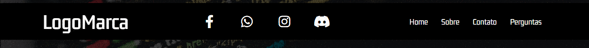
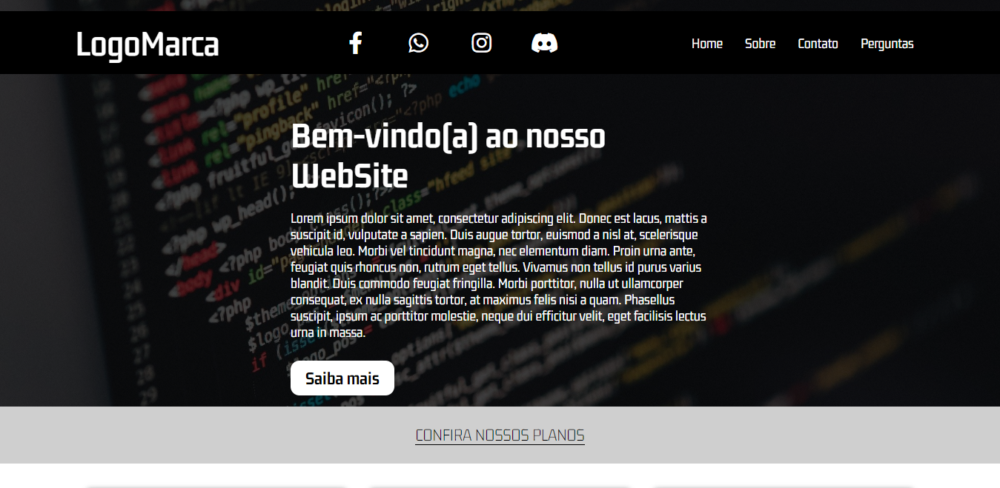
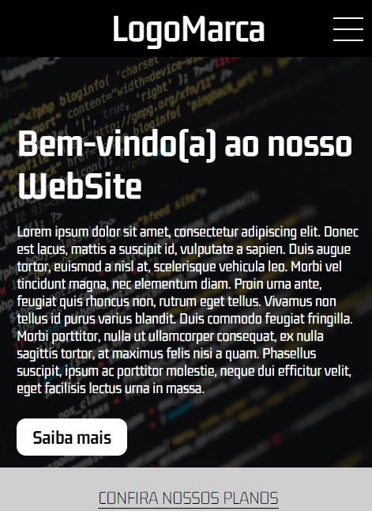

# Projeto WebSite

Projeto de um WebSite responsivo, onde o intuito foi praticar a utilização de animações em CSS e também eventos utilizando o JavaScript via JQuery.

<button style="cursor: pointer;"><a href="https://joaoparaujocr.github.io/WebSite/" target="blank">Link para visualizar o projeto</a></button>

# Imagens do Projeto

    <h2>Desktop</h2>
    

        
        
    

    

        
    

    <h2>Mobile</h2>
    

        
    

    

        
    

# Tecnologias

    
    
    
    

